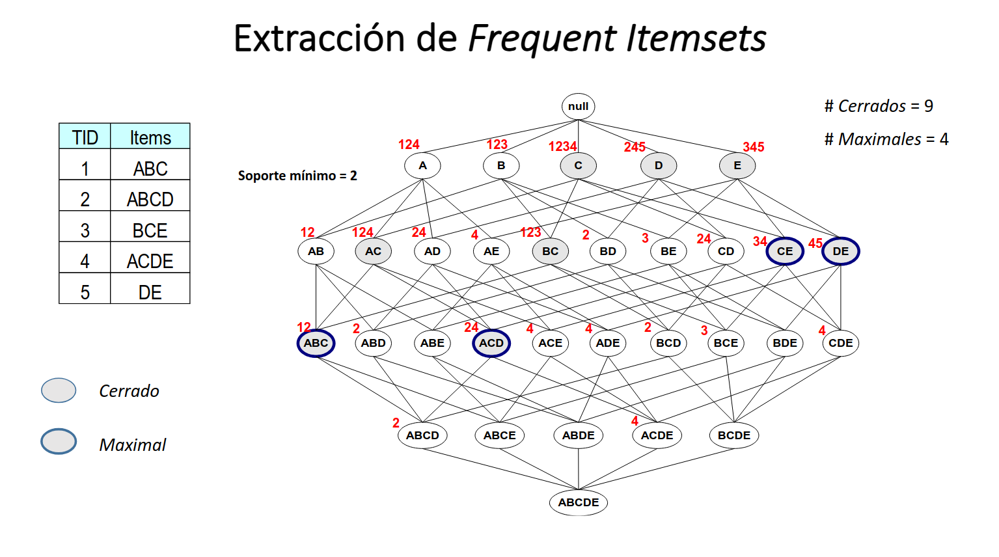

# Maximal/Closed Frequent Itemsets

The goal of this project is to implement a program that efficiently **finds the maximal and closed frequent itemsets** in a dataset of transactions.

> This project is an assignment for the course "Unsupervised Learning Methods and Anomaly Detection" at the Master in Artificial Intelligence Research at the Universidad Internacional Menéndez Pelayo (UIMP).

## Requirements

The program is written in Python 3.13.1 and tested with Python 3.8.0. No external libraries are required.

## Usage

The program can be executed from the command line with the following command:

```bash
python src/main.py
```

### Configuration

You can configure the program using the following parameters set as environment variables:

- `DATA_FILE`: Path to the dataset file. Default: `data/data.csv`.
- `MIN_SUPPORT`: Minimum support for an itemset to be considered frequent. Default: `6`.

## Dataset

The dataset is a CSV file with the following format:

- `data/test.csv` [Dataset](data/test.csv)

  ```csv
  A,B,C
  A,B,C,D
  B,C,E
  A,C,D,E
  D,E
  ```

The `id` column is the identifier of the transaction, but is not used by the program. The `items` column contains the items of the transaction, separated by no spaces.

## Output

The program will output the frequent, maximal, and closed itemsets found in the dataset. For example, with the `data/test.csv` dataset and minimum support of 2, the output will be:

```txt
------------------
Frequent Itemsets:
------------------
L(1):
  - {'C'}: 4
  - {'B'}: 3
  - {'A'}: 3
  - {'D'}: 3
  - {'E'}: 3
L(2):
  - {'D', 'C'}: 2
  - {'E', 'C'}: 2
  - {'C', 'B'}: 3
  - {'D', 'A'}: 2
  - {'B', 'A'}: 2
  - {'C', 'A'}: 3
  - {'D', 'E'}: 2
L(3):
  - {'C', 'B', 'A'}: 2
  - {'D', 'C', 'A'}: 2

--------------------------
Maximal Frequent Itemsets:
--------------------------
 - {'E', 'C'}: 2
 - {'D', 'E'}: 2
 - {'C', 'B', 'A'}: 2
 - {'D', 'C', 'A'}: 2

--------------------------
Closed Frequent Itemsets:
--------------------------
 - {'C'}: 4
 - {'D'}: 3
 - {'E'}: 3
 - {'E', 'C'}: 2
 - {'C', 'B'}: 3
 - {'C', 'A'}: 3
 - {'D', 'E'}: 2
 - {'C', 'B', 'A'}: 2
 - {'D', 'C', 'A'}: 2
```

The `data/test.csv` has been obtained from the course slides. This way we can check the correctness of the program.



## Alternative Dataset

To test the program with more data, the [test dataset](data/test.csv) has been expanded to the [alternative dataset](data/data.csv) with 20 transactions.

## Methodology

The program first reads the dataset and finds the frequent itemsets. Then, it finds the maximal and closed frequent itemsets from the frequent itemsets.

> The code comments and function docstrings provide more detailed information about the implementation.

For each of these steps, the program uses the following algorithms:

### 1. Frequent Itemsets

The program uses a Depth-First Search (DFS) algorithm to find the frequent itemsets. The algorithm follows these steps:

1. The algorithm starts by generating candidate itemsets of size 1 and counting their occurrences in the dataset. Items that meet the minimum support threshold are kept as frequent itemsets.
2. The algorithm then recursively explores larger itemsets by adding items to the current itemsets and checking their support. This process continues until no more frequent itemsets can be found.

> The implementation leverages recursion to handle the exploration and counting of itemsets at different levels of the search space. The function `generate_frequent_itemsets` implements the algorithm using the `find_frequent_itemsets_rec` recursive helper function.

#### Efficiency Improvements

- **Pruning**: The algorithm prunes the search space by avoiding the generation of candidate itemsets that are supersets of infrequent itemsets.
- **Support Counting**: The program stores the transactions in an inverted index (See `build_transactions_inverted_index`) to efficiently count the support of candidate itemsets using the `compute_support` function.
- **Frequent Itemsets Storage**: The program stores the frequent itemsets in a dictionary where each key is the size of the itemset and the value is a dictionary of itemsets and their support counts.

### 2. Maximal Frequent Itemsets

The program iterates over all frequent itemsets and checks if they are maximal by verifying that none of their supersets are frequent. If an itemset is maximal, it is added to the list of maximal frequent itemsets.

#### Efficiency Improvements

By leveraging the frequent itemsets dictionary generated in the previous step, the program can efficiently check the supersets of a given itemset, avoiding unnecessary comparisons.

### 3. Closed Frequent Itemsets

The program iterates over all frequent itemsets and checks if they are closed by verifying that none of their supersets have the same support. If an itemset is closed, it is added to the list of closed frequent itemsets.
